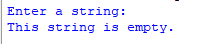
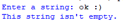

## Description
This program prompts the user to input a string and then determines whether the entered string is empty or not. If the string contains no characters, it will report "This string is empty." Otherwise, it will indicate "This string isn't empty."
## Example
♡ Example 1  
  
♡ Example 2  

